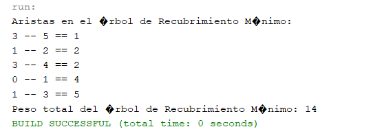
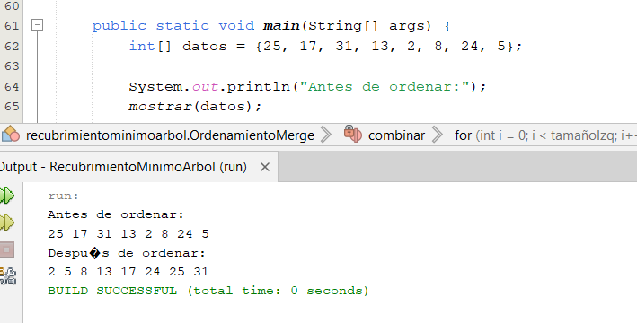
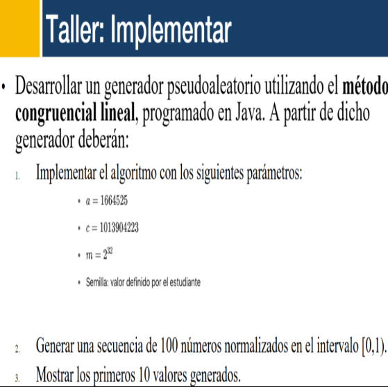
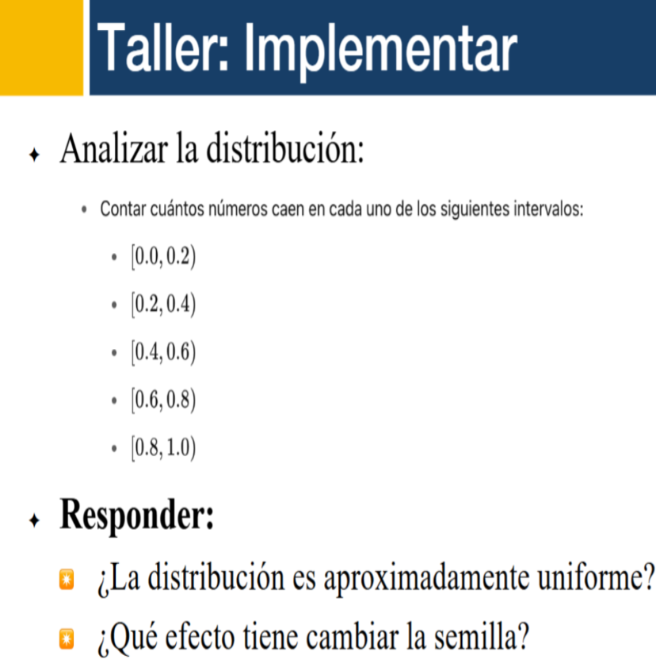
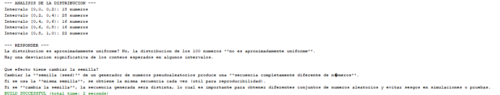
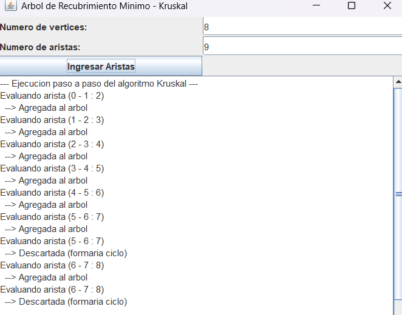
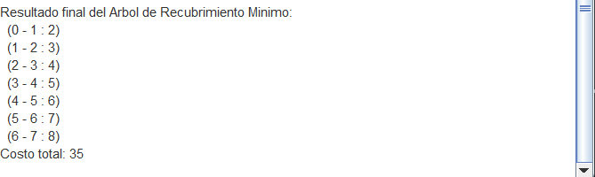

# Segundo Bimestre – Análisis de Algoritmos

---

## Semana 09: Algoritmo de Kruskal

El **algoritmo de Kruskal** es un método voraz para hallar el Árbol de Recubrimiento Mínimo (**MST**, *Minimum Spanning Tree*) de un grafo no dirigido y conectado. Su objetivo es unir todos los vértices del grafo con el menor costo total posible, sin formar ciclos.

**Funcionamiento:**

1. Ordenar todas las aristas del grafo según su peso (de menor a mayor).
2. Inicializar un conjunto disjunto (Union-Find) donde cada vértice es su propio conjunto.
3. Recorrer las aristas en orden ascendente:
   - Si los extremos están en conjuntos diferentes, se agrega la arista al MST y se unen los conjuntos.
   - Si los extremos ya están en el mismo conjunto, se descarta para evitar ciclos.
4. El proceso termina cuando el MST tiene (n - 1) aristas, siendo n el número de vértices.

**Complejidad:**

- Ordenar aristas: \(O(E \log E)\)
- Union-find optimizado: casi lineal, \(O(E \alpha(V))\)

**Código ejemplo en Java:**

```java
public class KruskalAlgorithm {
    // ...clases internas Edge, Subconjunto...
    // ...funciones agregarArista, encontrar, unir...

    public void kruskal() {
        // Implementación estándar de Kruskal usando Union-Find.
    }

    public static void main(String[] args) {
        // Crear el grafo, agregar aristas y ejecutar kruskal().
    }
}
```

**Aplicaciones:**

- Diseño de redes eléctricas, telecomunicaciones, caminos, etc.
- Optimización de costos en conexiones.

**💡 Ampliando:**

- El MST no siempre es único si hay pesos repetidos.
- Union-Find optimizado usa compresión de caminos y unión por rango.
- Si se omite la compresión, puede ser mucho más lento.

---

## Semana 10: Algoritmo de Prim

El **algoritmo de Prim** es otro método para hallar el MST, pero funciona diferente a Kruskal.\
Parte desde cualquier vértice y, en cada paso, elige la arista más barata que conecta el árbol actual con un nodo no visitado.

**Características:**

- Solo para grafos no dirigidos y con pesos positivos.
- Puede implementarse con un arreglo de distancias o una cola de prioridad (heap).

**Pseudocódigo básico:**

```
Prim(G, inicio):
    Para cada nodo v:
        distancia[v] = infinito
        padre[v] = nulo
        visitado[v] = falso
    distancia[inicio] = 0
    Mientras haya nodos no visitados:
        u = nodo no visitado con menor distancia
        visitado[u] = verdadero
        Para cada vecino v de u:
            si peso(u, v) < distancia[v] y v no visitado:
                distancia[v] = peso(u, v)
                padre[v] = u
```

**Comparación Kruskal vs Prim:**

- Kruskal: mejor en grafos dispersos, elige siempre la arista mínima global.
- Prim: mejor en grafos densos, crece desde un nodo como "isla".

**Ampliando:**

- Con cola de prioridad, Prim puede correr en \(O(E \log V)\).
- Se usa mucho en redes urbanas y problemas de expansión.

---

## Semana 11: Divide y Vencerás & Búsqueda Binaria

El paradigma **Divide y Vencerás** resuelve problemas dividiéndolos en subproblemas más pequeños, resuelve cada uno de forma recursiva y luego combina los resultados.

### Búsqueda Secuencial:

```java
public static int Secuencial(int[] T, int x) {
    // Busca x recorriendo el arreglo de inicio a fin
}
```

- Peor caso: Θ(n)
- Mejor caso: Θ(1)

### Búsqueda Binaria (requiere arreglo ordenado)

**Versión recursiva:**

```java
public static int BinRec(int[] T, int i, int j, int x) {
    // Implementación recursiva
}
```

**Versión iterativa:**

```java
public static int BinIter(int[] T, int x) {
    // Implementación iterativa
}
```

- Complejidad: Θ(log n) en promedio y peor caso.

### Ordenamiento Merge Sort (Divide y Vencerás)

```java
public class OrdenamientoMerge {
    // dividir, combinar, ordenar...
}
```

**Ampliando:**

- Divide y vencerás se usa también en QuickSort, Karatsuba, FFT, etc.
- Permite paralelizar problemas en computadoras multinúcleo.

---

## Semana 12: Mediana y Multiplicación de Matrices

### Mediana

La **mediana** es el valor que divide una muestra en dos partes iguales.

- Si n es impar: es el valor central.
- Si n es par: se suele promediar los dos centrales.

**¿Para qué sirve?**

- Es robusta ante valores atípicos.
- Se usa como pivote en algoritmos de selección y partición.

### Multiplicación de Matrices

Solo se puede multiplicar una matriz A (\(m \times n\)) con una matriz B (\(n \times p\)), el resultado es C (\(m \times p\)).

$$
C[i][j] = \sum_{k=1}^n A[i][k] \cdot B[k][j]
$$

**Ejemplo básico:**

```java
// Multiplicación de dos matrices en Java
```

**Ampliando:**

- En gráficos, física e IA, la multiplicación de matrices es esencial.
- Existen algoritmos avanzados como Strassen que aceleran la operación.

---

## Semana 13: Algoritmos Aleatorios y Tiempo Esperado

### ¿Qué es el tiempo esperado?

En algoritmos aleatorios, el tiempo de ejecución varía.\
El **tiempo esperado** es el promedio después de ejecutar muchas veces con la **misma entrada**.

| Aspecto                  | Deterministas (Promedio)    | Aleatorios (Tiempo esperado) |
| ------------------------ | --------------------------- | ---------------------------- |
| ¿Qué varía?              | Solo entrada                | El propio algoritmo          |
| ¿Cómo se mide el tiempo? | Promedio distintas entradas | Promedio misma entrada       |

### Números Pseudoaleatorios

- Se generan mediante fórmulas (no son verdaderamente aleatorios).
- El **Generador Congruencial Lineal** es el más clásico:
  $$
  X_{n+1} = (a \cdot X_n + c) \mod m
  $$
  - a, c, m: constantes
  - X0: semilla inicial

**Código ejemplo en Java:**

```java
public class GeneradorCongruencialLineal {
    // ...a, c, m y métodos para generar números normalizados...
}
```

**¿La distribución es uniforme?**

- Depende de la calidad de los parámetros y el tamaño de la muestra.
- Cambiar la **semilla** genera secuencias completamente diferentes (importante para simulaciones).

**Ampliando:**

- Usar la misma semilla permite reproducibilidad en experimentos.
- Para aplicaciones críticas, se usan generadores más sofisticados (Mersenne Twister, criptográficamente seguros).

---

## Semana 14: Algoritmos de Monte Carlo

Los **algoritmos Monte Carlo** usan el azar para resolver problemas aproximados, especialmente cuando una solución exacta sería demasiado costosa.

### Características principales:

- Responden con soluciones aproximadas y controlan el error mediante la cantidad de muestras.
- Dependientes de la calidad del generador pseudoaleatorio.

### Ejemplo: Estimación de π

1. Simula lanzar puntos aleatorios en un cuadrado.
2. Cuenta cuántos caen dentro de un círculo inscrito.
3. La proporción permite estimar π.

### Aplicaciones:

- Finanzas: modelar inversiones y riesgos.
- Física: simulaciones y experimentos.
- IA y Machine Learning: optimización y toma de decisiones bajo incertidumbre.
- Juegos y gráficos.

**Diferencia Monte Carlo vs Las Vegas:**

- Monte Carlo: resultado probablemente correcto, pero no garantizado.
- Las Vegas: siempre correcto, pero tiempo variable.

---

## ZONA DE CAPTURAS
 

Estas capturas estan en orden cronologico simplemente el hecho de ponerlas junto al texto confundirian las actividades
---
